# SL1C3D-L4BS Masterclass — Full-Scope Implementation Plan (Redirected)

This plan implements the Masterclass Architecture with **ID: 008, 009, 010, and 011** corrections: UWSM as first-class session architecture; theme source-of-truth in repo (runtime `theme.json` is generated only); docs repo-only (no chezmoi deploy); no `chezmoi apply` on login; three-layer checks (lint / doctor / validate); Nix flakes+packages+devShells only (Home Manager deferred); AGS quarantine; `sl1c3d` as the workstation operator surface. The repository remains a **flat chezmoi source at repo root**. **ID:009:** UWSM session entry path and hypridle migration fixed; repair default non-destructive with scoped flags; migration ledger and package-ownership mandatory; theme three-layer + one generator; CI render-sanity gate; AGS deadlines (milestone/date); benchmark acceptance/regression/hard-fail thresholds. **ID:010 (hardening):** hypridle mandatory by default (documented blocker to exempt); exact session target names from Phase 0 (no "or equivalent"); explicit uwsm finalize decision (Phase 0 determines, document yes/no and where); theme-sync authoritative, `sl1c3d theme apply` only entrypoint; repair preflight contract (--check intended actions, --apply chezmoi diff + affected units/artifacts); package-ownership six classes including UI/fonts/icons/launchers/wallpaper; CI fixed minimum render target set; Phase 10 real candidates only (no dot_config→chezmoi). **ID:011 (precision/enforcement):** Phase 0 emits **approved decision artifacts** (exact session targets, UWSM entry path, uwsm finalize, durable-daemon set, fixed CI render targets, package-source decisions). Phase 1 **hard acceptance** (every doc cites Phase 0; no placeholders; target→phase mapping; rollback or no-rollback). **render-sanity** exact pass/fail (zero exit, no unresolved vars, no missing keys, no empty required outputs, deterministic paths). **sl1c3d doctor** severity classes (fatal/degraded/informational). **Theme** file contract (canonical file, generator path, runtime JSON, consumer paths, committed/ignored/regenerated). **Benchmark** reproducibility (run counts, warm/cold, variance, CI-safe vs manual). **Phase 6** per-unit semantics (unit type, enable default, restart policy, failure severity, ordering). **host/arch** no empty dirs (real artifact or migration note). **Nix** package migration rules (Arch↔Nix, PATH precedence, duplicate binary, rollback per class). **Phase 10** proof required (before/after tree, ownership diff, rollback commands, validation, benchmark if runtime changed). After corrections: stop editing plan; execute Phase 0 only.

---

## 1. Decision Model (Authority for All Phases)

1. Preserve single ownership per artifact (no Nix + chezmoi on same file).
2. Preserve working behavior unless there is measurable architectural benefit.
3. Prefer additive documentation before destructive refactors.
4. Prefer logical restructuring before physical repo moves.
5. **UWSM-managed session:** durable daemons as systemd user units bound to `graphical-session.target`; minimal `exec-once`.
6. Prefer measurable performance work over speculative aesthetic refactors.
7. **Source truth in repo; generated state in runtime path.** No runtime file as canonical source.
8. **One artifact, one owner, one path of record.** No mirroring between `host/arch/` and `system-config/`; selective migration with explicit ownership transfer.

---

## 2. Current vs Target State (Summary)

| Area         | Current                                                                                                  | Target (masterclass-correct)                                                                                                 |
| ------------ | -------------------------------------------------------------------------------------------------------- | ---------------------------------------------------------------------------------------------------------------------------- |
| Session      | Hyprland `exec-once` for quickshell, swaync, cliphist, waypaper, hypridle, ags; `chezmoi apply` on login | **UWSM-managed Hyprland**; user units for durable daemons; **no** `chezmoi apply` on login                                   |
| Theme source | Scattered (`.chezmoidata`, QML, SCSS, JSON)                                                              | **Repo:** `theme.tokens.toml` or `.chezmoidata`-backed theme data. **Runtime:** generated `~/.config/sl1c3d/theme.json` only |
| Docs         | Under `dot_config/SL1C3D-L4BS/docs/`                                                                      | Top-level `docs/` **repo-only**; not deployed via chezmoi                                                                    |
| Host         | `dot_config/SL1C3D-L4BS/system-config/`                                                                  | `host/arch/` as **the** architecture-facing source; system-config transitional; **no** copy-paste mirror                     |
| Validation   | Single validate-configs script                                                                           | **Lint** (static, CI) / **Doctor** (environment, local) / **Validate** (config contract, local)                              |
| Nix          | None                                                                                                     | Flakes + package sets + devShells **only**; Home Manager deferred                                                            |
| AGS          | Coexistence with Quickshell                                                                              | **Quickshell = strategic;** AGS = **quarantine**; keep/migrate/delete per component                                         |
| CLI          | Wrappers                                                                                                 | **sl1c3d** = operator surface: doctor, validate, repair, benchmark, theme, edition, **bootstrap**, **session**             |

---

## 3. Three-Layer Validation (Lint / Doctor / Validate)

- **Lint** — Static only: shellcheck, stylua, luacheck, markdown lint, template syntax. Runs in CI; no environment or session required.
- **Doctor** — Environment and dependency health: Arch deps, Nix/flake, chezmoi, Wayland packages, fonts, portals, systemd user units, Hyprland syntax, Quickshell viability, AI service. Runs **locally**; `sl1c3d doctor`. **Severity classes (mandatory):** **fatal** (exit non-zero; e.g. missing Hyprland binary), **degraded** (session impaired; e.g. inactive quickshell user unit — fatal or degraded by edition), **informational** (e.g. AGS deprecated component present). Every check must be classified; output must be operationally actionable.
- **Validate** — Config/runtime contract checks: config presence, syntax, integration points. Runs **locally**; `sl1c3d validate`. Session-only checks stay local until a hermetic graphical harness exists.

**CI runs:** lint + template checks + docs checks + secret audit only. Do not force graphical-session semantics into early CI.

---

## 4. Implementation Phases (Redirected Order)

```mermaid
flowchart LR
  subgraph p0 [Phase 0]
    Freeze[freeze and inventory]
  end
  subgraph p1 [Phase 1]
    D1[docs repo-only]
  end
  subgraph p2 [Phase 2]
    CI[CI headless]
  end
  subgraph p3 [Phase 3]
    CLI[sl1c3d operator]
  end
  subgraph p4 [Phase 4]
    Theme[theme repo source]
  end
  subgraph p5 [Phase 5]
    Bench[benchmarks]
  end
  subgraph p6 [Phase 6]
    UWSM[UWSM plus systemd]
  end
  subgraph p7 [Phase 7]
    Scaffold[host nix tools]
  end
  subgraph p8 [Phase 8]
    Nix[Nix no HM]
  end
  subgraph p9 [Phase 9]
    UI[AGS quarantine]
  end
  subgraph p10 [Phase 10]
    Phys[physical if justified]
  end
  p0 --> p1 --> p2 --> p3 --> p4 --> p5 --> p6 --> p7 --> p8 --> p9 --> p10
```

---

### Phase 0 — Freeze and Inventory (NEW)

**Goal:** Freeze current runtime behavior; inventory everything before documenting target state. Masterclass execution starts with a hard inventory.

**Deliverables:**

- **Current-state inventory** — List every active daemon (process name, how started, config path). List every Hyprland bind and exec-once. List every config file that affects session (owner: chezmoi vs generated vs system).
- **Ownership inventory** — For each artifact under `dot_config/` and key scripts: owner (chezmoi / Nix / host / generated). No ambiguity.
- **Daemon inventory** — quickshell, swaync, cliphist, waypaper, swww, hypridle, hyprsunset, ags, gnome-keyring, hyprpolkitagent, openclaw-gateway, kanshi, atuin, restic timer. Source unit or exec-once; dependencies.
- **Startup inventory** — Order of execution on session start; all `sleep` usages; what depends on what.
- **Session target inventory** — **Exact** systemd user target names the installed UWSM stack exposes (e.g. `graphical-session.target`, `graphical-session-pre.target`). No placeholder "or equivalent" after this; Phase 6 uses these exact names.
- **UWSM finalize decision** — Determine whether Hyprland in this setup already exports `WAYLAND_DISPLAY` and related vars into the activation environment. Record: **uwsm finalize required (yes/no)** and, if yes, **where** it must run. Document outcome for Phase 6.
- **Generated-artifact inventory** — Files produced at runtime or by scripts (e.g. matugen outputs, edition.conf, host.conf). Path and generator.
- **Install path inventory** — Where packages come from (pacman, AUR, Nix, manual); which configs each uses.
- **Current benchmark baseline** — Shell startup, Neovim startuptime, validate-configs duration. Record in a single baseline file (e.g. `ci/baseline-pre-phase0.txt` or in docs).
- **"Do not break" list** — Explicit list of behaviors and paths that must remain working through all phases (e.g. login to Hyprland, bar visible, keybinds, OpenClaw sidebar).

**Mandatory Phase 0 outputs (approved decision artifacts):** Phase 0 must **emit** these as approved artifacts (not just gather facts). Later phases depend on them; no placeholder survives.

- **Exact session target names** — From session target inventory; the list Phase 6 will use verbatim.
- **Exact UWSM entry path** — Selected TTY path (e.g. `uwsm start hyprland.desktop`) and DM path; documented as the single chosen entry.
- **Exact uwsm finalize decision** — Required yes/no and, if yes, where it runs.
- **Exact durable-daemon migration set** — List of daemons that will become user units (quickshell, swaync, clipboard-history, wallpaper-restore, hypridle, theme propagation; no ambiguity).
- **Exact fixed CI render targets** — The minimum set for `ci/render-sanity.sh` (Hyprland core, Quickshell theme fragment, AGS token output, Starship if tokenized, one canonical runtime theme artifact); locked for Phase 2.
- **Exact ambiguous package-source decisions** — For any tool that could be Arch or Nix, record the decided source (per package-ownership classes) so Phase 8 has no open questions.

**Acceptance:** All inventories written; **all six approved decision artifacts emitted and documented**; baseline numbers captured; do-not-break list agreed and documented. No code refactors in Phase 0.

---

### Phase 1 — Canonical Documentation (Repo-Only)

**Goal:** Document current and target architecture. **Docs remain repo-only; do not deploy architecture docs via chezmoi.**

**Deliverables:**

- **Create top-level `docs/`** at repo root. **Do not** add chezmoi targets that materialize `docs/` into `$HOME`. Operational docs are referenced by README and CLI help only.
- **Architecture docs** (`docs/architecture/`):
  - `system-overview.md` — Layers (Arch, Nix, chezmoi, Hyprland), boot chain, **UWSM as target session model**, ownership summary.
  - `boot-session-lifecycle.md` — Full sequence, ownership-by-stage, lifecycle rules; **no GUI daemon before session env**; **minimal exec-once**.
  - `service-dependency-graph.md` — **UWSM + systemd user units** bound to `graphical-session.target`; ordering constraints; migration targets (quickshell, swaync, clipboard, wallpaper, hypridle, openclaw, theme propagation).
  - `ownership-matrix.md` — One owner per artifact; theme source in repo, generated runtime theme.json.
  - `migration-ledger.md` — For every host/system-config artifact: current path, target path, current owner, target owner, migration status, rollback path. Mandatory for any migration (Phase 7+).
  - `package-ownership.md` — **Six classes** (stack is UI-heavy; not just CLI vs host): **session-core** (compositor, UWSM, session substrate), **UI-support** (fonts, icon themes, app launchers, theme engines, wallpaper tools, session-adjacent GUI utilities), **toolchain** (CLI dev tools), **language/runtime**, **operator/diagnostic**, **theme/asset tooling**. For each class: Arch-only, Nix-preferred, or either-but-pinned. Include fonts, icon themes, app launchers, theme engines, wallpaper tools explicitly. Prevents package-source drift.
  - `performance-budget.md` — Budget table; telemetry sources; **acceptance/regression/hard-fail thresholds** (Phase 5).
- **Design system** (`docs/design-system/`): `tokens.md`, `motion.md`, `components.md` — reference **repo** theme source and generated outputs.
- **Operations** (`docs/operations/`): `bootstrap.md`, `recovery.md`, `backup.md`, `troubleshooting.md` — bootstrap must **not** assume `chezmoi apply` on login.
- **Developer** (`docs/developer/`): `cursor-rules.md`, `contribution-guide.md`.

**Acceptance (hard gates):**

- Every Phase 1 doc **must cite** a Phase 0 inventory or approved artifact (no doc stands alone).
- **No placeholder wording** survives into Phase 1 (e.g. no "TBD", "or equivalent", unbound "target").
- Every "target" or migration claim **must map to a phase owner** (which phase is responsible).
- Every migration-capable area **must have** either rollback language or an explicit "no rollback needed" note.
- All files exist under `docs/`; none are deployed to home via chezmoi.

---

### Phase 2 — CI Foundation (Headless-Only)

**Goal:** CI runs **lint** only (static + template + docs + secret audit). No doctor or validate in CI until hermetic graphical harness exists.

**Deliverables:**

- **Create top-level `ci/`** at repo root.
- `ci/secret-audit.sh` — Wrapper or symlink to audit-secrets script; run against repo.
- `ci/lint.sh` — **Lint layer only:** shellcheck on scripts and dot_config; stylua for nvim lua; optionally luacheck. No environment or session checks.
- `ci/docs-lint.sh` — Markdown lint for `docs/`.
- **`ci/render-sanity.sh`** (mandatory headless gate): **Exact pass/fail semantics** (enforceable, not interpretive). Fixed minimum render target set from Phase 0. For each target: **render target exists**; **render exits zero**; **no unresolved template variables**; **no missing data keys**; **no empty output** for required targets; **output path is deterministic**. Script must exit non-zero on any violation. Makes CI enforceable.
- `.github/workflows/ci.yml` at repo root: run secret-audit, lint, docs-lint, **render-sanity**; do not run doctor or validate in CI.

**Acceptance:** CI is strictly headless; no dependency on display/Wayland or live session.

---

### Phase 3 — `sl1c3d` Operator CLI

**Goal:** Evolve `sl1c3d` into the workstation operator surface (not a thin wrapper forever). doctor = dependency/state health; validate = config contract; repair = deterministic repair; benchmark = measurements; theme = apply/inspect/regenerate; edition = set/get/list/apply; bootstrap = first-time setup entrypoint; session = optional user-unit helpers.

**Deliverables:**

- **Implement `sl1c3d` CLI** at `dot_config/SL1C3D-L4BS/bin/` (e.g. `executable_sl1c3d`), installed to `~/bin` or `~/.local/bin` via chezmoi.
- **Subcommands (formalized):**
  - `sl1c3d doctor` — Run: Arch host deps (optional check), Nix/flake health, `chezmoi doctor`, Wayland packages, fonts, portals, systemd user unit status, Hyprland config syntax, Quickshell viability, AI service. **Severity classes:** **fatal** (e.g. missing Hyprland binary → exit non-zero), **degraded** (e.g. inactive quickshell unit — severity by edition), **informational** (e.g. AGS deprecated present). Every check classified; aggregate output; exit non-zero on any fatal.
  - `sl1c3d validate` — Invoke validate-configs script.
  - `sl1c3d repair` — **Default: non-destructive.** Scoped modes: `--check` (report **intended actions**, no changes; preflight visibility), `--units`, `--theme`, `--apply` (explicit: run chezmoi apply). **Preflight contract:** `repair --apply` must print **changed files**, **affected user units**, **theme artifacts to regenerate**; if chezmoi is involved, run **chezmoi diff preflight** before mutating state. Login/session must never run repair --apply.
  - `sl1c3d benchmark` — Invoke benchmark scripts (Phase 5); or stub until Phase 5.
  - `sl1c3d edition set <edition>` / `sl1c3d edition get` — Delegate to existing sl1c3d-edition script.
  - `sl1c3d theme apply` — **Only** public entrypoint for theme; invokes the single theme-sync pipeline (matugen may be used inside as input, not as competing authority).
  - `sl1c3d theme inspect` — Print canonical theme path and/or parsed tokens (after Phase 4).
  - `sl1c3d bootstrap` — First-time machine setup entrypoint (Nix, chezmoi, host bootstrap, user units).
  - `sl1c3d session` — Optional helpers for user-unit orchestration (status, start, stop).
- **Documentation:** README and docs reference `sl1c3d`; no instruction to run `chezmoi apply` on login.

**Acceptance:** All subcommands implemented or stubbed; **repair default is non-destructive** (no apply without `--apply`); only `repair --apply` and bootstrap run `chezmoi apply`; never on login/session startup.

---

### Phase 4 — Theme Source-of-Truth Redesign

**Goal:** **Source truth in repo; generated state in runtime path.** Formalize the theme system as **three layers** and choose **one authoritative generator**. Do not let matugen and hand-written scripts compete as equal generators.

**Deliverables:**

- **Layer A — Canonical repo tokens:** `.chezmoidata` theme section or `theme.tokens.toml` (or equivalent) in repo. Colors, spacing, radius, motion (120/180/260), typography, semantic roles. Chezmoi templates consume this.
- **Layer B — Generated intermediate runtime JSON:** `~/.config/sl1c3d/theme.json` is **generated** from Layer A by the **single authoritative generator**. Runtime tools read this; it is disposable.
- **Layer C — Consumer-specific outputs:** QML (BrandTheme), SCSS (sl1c3d-tokens), Hyprland snippets, Ghostty theme fragments, etc. All derived from Layer A (or B) by the **same authoritative generator**.
- **One generator (locked):** **theme-sync** is authoritative; **`sl1c3d theme apply`** is the **only** public entrypoint. Matugen only as input inside pipeline. Document in design-system.
- **Theme pipeline file contract (locked):** Define and document: **canonical token source file** (path in repo); **generator script path**; **generated runtime JSON path** (`~/.config/sl1c3d/theme.json`); **consumer output paths** (QML, SCSS, Hyprland snippets, Ghostty, etc.); **which artifacts are committed** vs **ignored** (e.g. theme.json in .gitignore); **exact set of artifacts regenerated by `sl1c3d theme apply`**. No ambiguity at file level.
- **Motion standardization:** Repo theme and docs/design-system/motion.md: fast=120, normal=180, slow=260. Update BrandTheme.qml, sl1c3d-tokens.scss, matugen quickshell template to 260 for slow.
- **Documentation:** docs/design-system/tokens.md: canonical source = repo; runtime theme.json = generated only; file contract table (paths, committed/ignored, regenerated-by theme apply).

**Acceptance:** Three-layer theme with **one generator**; **file contract** (canonical file, generator path, runtime JSON path, consumer paths, committed/ignored/regenerated) documented and enforced; motion 120/180/260; no new UI constants outside this system.

---

### Phase 5 — Benchmarking and Baselines

**Goal:** Measure before optimizing; required before performance claims. **Baselines alone are not enough:** add **enforceable gates** — acceptance thresholds, regression thresholds, and hard-fail thresholds so performance work becomes enforceable.

**Deliverables:**

- **Add `ci/startup-bench.sh`** (or `scripts/` and linked from ci/): Run and record shell startup, Neovim startuptime, config validation duration, Quickshell/theme where measurable. Targets and thresholds as below.
- **Baselines:** Record in performance-budget.md or docs/operations/benchmarks.md; note "pre–systemd migration."
- **Thresholds (mandatory):** For each benchmarked surface: baseline, target, acceptable regression (e.g. +10%), hard-fail (e.g. +20%). Document in performance-budget.md. `sl1c3d benchmark` exits non-zero when hard-fail exceeded.
- **Reproducibility constraints (mandatory):** Document: **shell benchmark environment** (e.g. clean login shell); **warm vs cold run count** (e.g. N cold, M warm); **machine-load assumptions** (idle vs typical); **acceptable variance window** (e.g. ±5% before flagging); **manual-only vs CI-safe** measurements (which benchmarks run in CI vs run manually in session). Prevents fake regressions and fake wins.
- **Integration:** `sl1c3d benchmark` invokes scripts, prints summary, and enforces thresholds.

**Acceptance:** Benchmark script runs with documented reproducibility rules; baselines and thresholds documented; no performance claims without measurements against thresholds.

---

### Phase 6 — UWSM + systemd User Session Migration

**Goal:** **Adopt UWSM-managed Hyprland** as the target session architecture. User services bind to `graphical-session.target`; durable GUI/session daemons are systemd user units; `exec-once` is minimal glue only. **Remove `chezmoi apply` from login/session startup** (it must be explicit via bootstrap/repair only). Prefer `dbus-broker` on Arch with UWSM (per Hyprland wiki).

**Deliverables:**

- **New systemd user units** (under `dot_config/systemd/user/`). **Per-unit semantics (mandatory):** For each unit define and document in service-dependency-graph: **unit type** (service), **enable default** (enabled), **start trigger**, **restart policy**, **ordering edges** (`After=`/`Wants=` from Phase 0), **failure behavior**, and **doctor severity** (fatal / degraded / informational if unit failed or inactive). Apply to: wallpaper-restore.service, clipboard-history.service, quickshell.service, swaync.service, hypridle.service (mandatory by default unless documented blocker), theme propagation service.
- **Ordering:** User units declare **exact** target names from Phase 0. Document exact `After=` and `Wants=` in service-dependency-graph. Remove all `sleep`-based sequencing from autostart.conf.
- **UWSM environment finalization (mandatory decision):** Phase 0 must determine whether Hyprland in this setup already exports `WAYLAND_DISPLAY` and related vars into the activation environment. **If yes:** document "no `uwsm finalize` required" in boot-session-lifecycle or service-dependency-graph. **If no:** add explicit `uwsm finalize` handling and document **where** it runs (e.g. after compositor ready). Do not leave this implicit (ArchWiki UWSM).
- **UWSM session entry path (explicit):** TTY path (e.g. `uwsm start hyprland.desktop`); DM path (UWSM-managed Hyprland desktop entry); **App launch rule:** Use `uwsm app --` for autostarted session apps and relevant bind-launched desktop apps. Document in service-dependency-graph and boot-session-lifecycle.
- **Hyprland autostart.conf:** **Remove `exec-once = chezmoi apply`** entirely. Reduce to: hyprpolkitagent, gnome-keyring daemon, dbus-update-activation-environment + portal start, optionally one-shot hyprsunset. No durable services as compositor children; use `uwsm app --` where session apps are launched.
- **Bootstrap/install scripts:** Enable new user units so `systemctl --user enable` is run for new services.
- **Validation:** Update validate-configs to check that key user units are enabled and (if possible) active. Run benchmarks again and record "post–systemd migration" in performance budget.
- **UWSM / D-Bus:** Document or recommend `dbus-broker` on Arch for UWSM. Ensure no durable daemon is launched as child of compositor.

**Acceptance:** UWSM-managed session; Quickshell, swaync, clipboard, wallpaper, **hypridle** (mandatory unless documented blocker), and theme propagation run as user units with **exact** target names from Phase 0; **uwsm finalize** decision documented (required or not, and where); session entry path (TTY + DM) and `uwsm app --` rule documented; no `chezmoi apply` in autostart; validation passes.

---

### Phase 7 — Architecture Scaffolding (host, tools, nix)

**Goal:** Add `host/`, `nix/`, `ci/`, `tools/`, `docs/` around the flat repo. **Do not duplicate** `host/arch/` and system-config: `host/arch/` is the single path of record; system-config is transitional. **Mandatory:** every host/system-config migration must be logged in a **migration ledger** so selective migration does not become silent duplication.

**Deliverables:**

- **Create `host/arch/`** at repo root. **Rule: no empty placeholder architecture.** No directory under `host/arch/` may exist without either **(a)** a real artifact (file or script), or **(b)** a migration note pointing to the current live artifact (e.g. "see dot_config/… until migrated"). Prevents placeholder sprawl.
  - `host/arch/packages/`, `host/arch/boot/`, `host/arch/sysctl/`, `host/arch/systemd/`, `host/arch/bootstrap/` — Document or list; single path of record; migrate from system-config with ledger.
- **Create `tools/`** at repo root: theme-engine, edition-switcher, diagnostics (sl1c3d doctor wrapper).
- **Create `nix/`** at repo root (scaffold only in Phase 7): flake.nix, home/, shells/; no Home Manager; flake check passes in Phase 8.
- **Migration ledger (mandatory):** Add `docs/architecture/migration-ledger.md`. For every host-owned artifact, record: current path, target path, current owner, target owner, migration status, rollback path. No migration without a ledger entry.
- **Documentation:** Update system-overview and bootstrap to map system-config to host/arch; reference migration-ledger.

**Acceptance:** Directories exist; **migration-ledger.md** exists and every migrated artifact has an entry; host/arch is single path of record; no duplicate logic in both places; nix flake valid in Phase 8.

---

### Phase 8 — Nix Mode A (Flakes + Packages + devShells Only)

**Goal:** Nix owns user packages and dev shells; chezmoi owns all configs. **Delay Home Manager** unless one of: need HM activation semantics, portable package roles across machines, or proven leverage beyond flakes + profiles + devShells. Use flakes, package sets, and devShells only in this phase.

**Deliverables:**

- **Nix package sets** in `nix/home/` (or flake outputs): Core CLI (neovim, ripgrep, bat, eza, fd, zoxide, starship, fzf, etc.); Languages (nodejs, go, python, rustup/rust); Dev (LSPs, formatters, linters). Nix installs **binaries only**; configs remain in chezmoi.
- **Integration mode:** Use `nix profile install` or `nix build` + PATH from flake. Do not introduce Home Manager in this phase. Document in ownership-matrix and bootstrap.
- **Package ownership:** Implement package-ownership.md with six classes; per-class policy (Arch-only, Nix-preferred, either-but-pinned). **Package migration rules (operational):** Document: **Arch→Nix** (what to uninstall from Arch, how to add to flake, rollback); **Nix→Arch** (remove from profile, install via pacman/AUR, rollback); **PATH precedence** (e.g. Nix profile before /usr when both provide same binary); **duplicate binary conflict rule** (which source wins per class); **rollback rule per package class** (how to revert a moved package). Package ownership must be operational, not just descriptive.
- **Bootstrap order:** Document and optionally script: install Nix → `nix profile install` → chezmoi init/apply → existing bootstrap. Resolve duplicates per package-ownership.md.
- **Dev shells:** Add at least one `nix develop` shell; `nix develop` is a supported workflow.
- **CI:** Add `nix flake check` to CI.

**Acceptance:** Package migration rules documented; `nix profile install` installs user packages; configs applied by chezmoi; no double ownership; flake check passes.

---

### Phase 9 — UI Convergence (AGS Quarantine)

**Goal:** **Quickshell = strategic UI framework.** **AGS = temporary compatibility layer.** Every AGS component must have a **sunset decision: keep, migrate to Quickshell, or delete.** No net-new AGS surface unless Quickshell cannot realistically cover it. Unify tokens and motion.

**Deliverables:**

- **AGS quarantine:** In docs/design-system/components.md, for **each** AGS component require: **decision** (keep / migrate / delete), **owner** (who maintains or migrates), **milestone/date** (deadline). Without a date or milestone, quarantine becomes permanent coexistence. **Target replacement** or **justification** for keep must be documented. No new AGS features unless Quickshell cannot cover them.
- **Token and motion cleanup:** Ensure no duplicated theme constants in QML; all spacing, radius, motion, typography come from canonical theme or BrandTheme/sl1c3d-tokens derived from it.
- **Error states and feedback:** Review Quickshell and AGS flows so user-triggered actions have visible success/failure feedback and degrade gracefully; document in components.md.
- **Motion curves:** In docs/design-system/motion.md and theme, name curves (easeOutCubic, easeOutExpo, easeInCubic); ensure Bar.qml and other QML use theme tokens for duration and, where possible, curve type.

**Acceptance:** Every AGS component has decision + owner + **milestone/date**; design-system and canonical theme are single source for tokens/motion; no new UI constants outside the token system.

---

### Phase 10 — Physical Refactors Only If Justified

**Goal:** Move files or directories only where architecture materially benefits. **Proof required, not opinion.**

**Deliverables:**

- **Eligibility:** A physical refactor may proceed **only if** it shows at least one: **measurable maintenance reduction**, **reduced ownership ambiguity**, or **reduced runtime complexity**. **Acceptable candidates only:** host-owned artifacts system-config → `host/arch/`; standalone scripts → `tools/`; consolidate legacy theme fragments under one generation path. **Do not** list moving `dot_config/` into `chezmoi/dot_config/` (already decided against).
- **Required proof for each move:** **Before tree**; **after tree**; **ownership diff**; **rollback command sequence**; **validation output**; **benchmark comparison** if startup/runtime paths changed. Document benefit, risk, rollback. Update chezmoi sourceDir only if repo layout actually changes; update bootstrap and docs; run full validation and benchmark.

**Acceptance:** No mandatory physical refactor; any move is justified with proof (before/after tree, ownership diff, rollback commands, validation, benchmark if applicable) and documented.

---

## 5. Cursor Implementation Constraints (§50 + ID:008)

- No destructive repo moves in early phases.
- No Nix ownership of files already managed by chezmoi.
- No performance claims without benchmark output.
- No new UI constants outside the canonical token system.
- No new session daemons via `exec-once` if they should be durable services.
- **No `chezmoi apply` on login or session startup;** explicit only (bootstrap, repair, manual).
- No AGS feature retained without a sunset decision (keep/migrate/delete) and documented justification.
- Every phase must end with validation and updated docs.
- Theme canonical source in repo only; runtime theme.json is generated; **one** authoritative generator (no competing matugen vs hand-written).
- **Do not broaden scope;** tighten only. Plan is operationally strict: fewer optional branches, tighter acceptance gates, explicit migration ledger.

---

## 6. Validation and Success Criteria (Per Phase)

- **After each phase:** Run `sl1c3d validate` (or validate-configs until CLI exists); run secret audit; update any doc that ownership or layout changed.
- **After Phase 6:** Run benchmark script and compare to Phase 5 baselines.
- **After Phase 8:** Run `nix flake check`; confirm no double ownership.
- **Golden suite:** Existing validate, edition, secret audit, UI blur rules should keep passing; extend with doctor/benchmark when available.

---

## 7. File and Directory Summary

| Path                                       | Purpose                                                                                                              |
| ------------------------------------------ | -------------------------------------------------------------------------------------------------------------------- |
| `docs/`                                    | New top-level: architecture (incl. migration-ledger.md, package-ownership.md), design-system, operations, developer  |
| `docs/architecture/migration-ledger.md`    | Mandatory: every host/system-config migration logged (path, owner, status, rollback)                                  |
| `docs/architecture/package-ownership.md`   | Six classes; migration rules (Arch↔Nix, PATH, duplicate binary, rollback per class)                                  |
| `ci/render-sanity.sh`                      | Exact pass/fail: target exists, exit zero, no unresolved vars/keys, no empty required output, deterministic path   |
| `ci/`                                      | New: secret-audit.sh, lint.sh, docs-lint.sh, startup-bench.sh                                                        |
| `host/arch/`                               | New: packages, boot, sysctl, systemd, bootstrap (docs + optional scripts)                                          |
| `nix/`                                     | New: flake.nix, home/, shells/ (Phase 7 scaffold, Phase 8 real)                                                     |
| `tools/`                                   | New: theme-engine, edition-switcher, diagnostics                                                                    |
| Repo: `theme.tokens.toml` or .chezmoidata  | Canonical theme source (repo only)                                                                                   |
| `~/.config/sl1c3d/theme.json`              | Generated runtime artifact from repo source                                                                          |
| `dot_config/systemd/user/`                 | Add: wallpaper-restore, clipboard-history, quickshell, swaync, hypridle (mandatory unless documented blocker), theme |
| `dot_config/hypr/autostart.conf`            | Minimal bootstrap; **remove** exec-once chezmoi apply; daemons = systemd user units                                |
| `dot_config/SL1C3D-L4BS/bin/`              | Add: sl1c3d CLI (or executable_sl1c3d)                                                                              |
| `.github/workflows/ci.yml`                  | New at repo root: run ci/ scripts                                                                                    |

---

## 8. Masterclass To-Do List (Completion Checklist)

Highly detailed, phase-ordered checklist for implementation and verification.

### Phase 0 — Freeze and Inventory

- Create `docs/inventory/` or single inventory doc.
- List every active daemon: name, how started (exec-once vs systemd), config path.
- List every Hyprland bind and exec-once from dot_config/hypr/.
- List every config file affecting session with owner (chezmoi / generated / system).
- Ownership inventory: for each artifact under dot_config and key scripts, assign owner (chezmoi / Nix / host / generated).
- Daemon inventory table: quickshell, swaync, cliphist, waypaper, swww, hypridle, hyprsunset, ags, gnome-keyring, hyprpolkitagent, openclaw-gateway, kanshi, atuin, restic timer; source (unit or exec-once), dependencies.
- Startup inventory: exact order of execution on session start; list every `sleep` and its purpose; dependency chain.
- Generated-artifact inventory: path, generator (e.g. matugen, sl1c3d-edition), consumed by.
- Install-path inventory: package source (pacman / AUR / Nix / manual) per relevant package; config path each uses.
- Run shell startup benchmark (e.g. hyperfine or zprof); record in baseline file.
- Run Neovim --startuptime; record in baseline file.
- Time validate-configs.sh; record in baseline file.
- Write "Do not break" list: login to Hyprland, bar visible, keybinds, OpenClaw sidebar, fuzzel launcher, etc.
- Emit **six approved decision artifacts**: exact session target names; exact UWSM entry path; exact uwsm finalize decision; exact durable-daemon migration set; exact fixed CI render targets; exact ambiguous package-source decisions. Document each.
- Freeze: no code or config changes in Phase 0; inventory only.

### Phase 1 — Canonical Documentation (Repo-Only)

- Create top-level `docs/` at repo root.
- Ensure no chezmoi target deploys `docs/` to $HOME.
- Add docs/architecture/system-overview.md, boot-session-lifecycle.md, service-dependency-graph.md, ownership-matrix.md, migration-ledger.md, package-ownership.md, performance-budget.md.
- Add docs/design-system/tokens.md, motion.md, components.md.
- Add docs/operations/bootstrap.md, recovery.md, backup.md, troubleshooting.md (bootstrap does not assume chezmoi apply on login).
- **Phase 1 acceptance:** Every doc cites a Phase 0 artifact; no placeholder wording; every target claim mapped to phase; every migration-capable area has rollback or "no rollback needed."
- Add docs/developer/cursor-rules.md, contribution-guide.md.
- README and CLI help reference docs; no deployment of docs via chezmoi.

### Phase 2 — CI Foundation (Headless-Only)

- Create top-level `ci/` at repo root.
- Add ci/secret-audit.sh, ci/lint.sh, ci/docs-lint.sh.
- Add ci/render-sanity.sh: fixed minimum render targets from Phase 0; **exact pass/fail**: render exists, exit zero, no unresolved template vars, no missing keys, no empty required outputs, deterministic output paths.
- Add .github/workflows/ci.yml at repo root: run secret-audit, lint, docs-lint, render-sanity; do not run doctor or validate.
- Verify CI runs on push/PR with no display/Wayland dependency.

### Phase 3 — sl1c3d Operator CLI

- Add sl1c3d script under dot_config/SL1C3D-L4BS/bin/ (e.g. executable_sl1c3d); ensure on PATH via chezmoi.
- Implement sl1c3d doctor: same checks; **severity classes**: fatal (exit non-zero), degraded, informational; every check classified; exit non-zero on fatal.
- Implement sl1c3d validate, repair (--check, --units, --theme, --apply), benchmark, theme apply/inspect, edition, bootstrap, session.
- Update README and docs: reference sl1c3d; remove any instruction to run chezmoi apply on login.

### Phase 4 — Theme Source-of-Truth Redesign

- Add repo canonical theme source: theme.tokens.toml or .chezmoidata section (colors, spacing, radius, motion 120/180/260, typography, semantic roles).
- Add script or chezmoi run to generate ~/.config/sl1c3d/theme.json from repo source; document that this file is generated only.
- Add theme-sync script or matugen post-hook to generate QML fragment, SCSS variables, Hyprland snippets from repo data.
- Set motion slow=260 in repo theme and all consumers; update BrandTheme.qml, sl1c3d-tokens.scss, matugen quickshell template.
- **Theme file contract:** Document canonical token file path, generator script path, generated runtime JSON path, consumer output paths, which artifacts committed vs ignored, exact set regenerated by `sl1c3d theme apply`.
- Update docs/design-system/tokens.md: canonical source = repo; runtime theme.json = generated only.

### Phase 5 — Benchmark Baselines

- Add ci/startup-bench.sh: shell startup, Neovim startuptime, validate-configs duration, optional Quickshell/theme timing.
- Record baselines in docs/architecture/performance-budget.md; label pre-systemd-migration.
- Define for each surface: baseline, target, acceptable regression (e.g. +10%), hard-fail (e.g. +20%); document in performance-budget.md.
- Wire sl1c3d benchmark to run scripts, print summary, and enforce thresholds (exit non-zero on hard-fail).
- **Reproducibility:** Document shell environment, warm/cold run count, machine-load assumptions, acceptable variance, manual-only vs CI-safe measurements.

### Phase 6 — UWSM + systemd Session Migration

- Remove exec-once = chezmoi apply from dot_config/hypr/autostart.conf.
- Add systemd user units: wallpaper-restore, clipboard-history, quickshell, swaync, hypridle (mandatory unless blocker), theme propagation. **Per-unit semantics:** In service-dependency-graph, for each unit document: unit type, enable default, restart policy, failure behavior, doctor severity (fatal/degraded/info), ordering edges.
- Set After= and Wants= using **exact target names from Phase 0 inventory**; remove sleep-based ordering from autostart.
- Reduce autostart.conf to: hyprpolkitagent, gnome-keyring, dbus-update-activation-environment + portal start, optional one-shot hyprsunset; no durable daemons as compositor children.
- Document UWSM and dbus-broker recommendation in docs.
- Update bootstrap/install scripts to enable new user units.
- Update validate-configs to check user units enabled/active.
- Re-run benchmarks; record post-migration in performance budget.

### Phase 7 — Architecture Scaffolding

- Create host/arch/ (packages, boot, sysctl, systemd, bootstrap). **Rule:** No directory under host/arch/ without (a) real artifact or (b) migration note to live artifact. Add/update migration-ledger.md: every migrated artifact has entry; no migration without ledger entry.
- Create tools/ (theme-engine, edition-switcher, diagnostics).
- Create nix/ scaffold: flake.nix, home/, shells/; no Home Manager; flake check passes.
- Update docs to map system-config to host/arch where migrated.

### Phase 8 — Nix Mode A (No Home Manager)

- Add Nix package sets (core CLI, languages, dev tools); configs remain in chezmoi.
- Use nix profile install or nix build + PATH from flake; do not introduce Home Manager.
- Add at least one nix develop shell in nix/shells/.
- Document bootstrap order: install Nix, nix profile install, chezmoi init/apply, run host bootstrap.
- Add nix flake check to CI; confirm no double ownership.
- **Package migration rules (package-ownership.md):** Document Arch→Nix (uninstall Arch, add to flake, rollback); Nix→Arch (remove from profile, install via pacman/AUR, rollback); PATH precedence; duplicate binary conflict rule; rollback per package class.

### Phase 9 — UI Convergence (AGS Quarantine)

- In docs/design-system/components.md, list each AGS component with: decision (keep/migrate/delete), owner, milestone/date (deadline), target replacement or justification for keep.
- Token and motion cleanup: no duplicated constants; all from repo theme or derived outputs.
- Error states and feedback: document in components.md; ensure Quickshell/AGS flows degrade gracefully.
- Motion curves named in docs and theme; QML uses theme tokens.

### Phase 10 — Physical Refactors Only If Justified

- **Proof required:** Only if move shows measurable maintenance reduction, reduced ownership ambiguity, or reduced runtime complexity. For each move: **before tree**, **after tree**, **ownership diff**, **rollback command sequence**, **validation output**, **benchmark comparison** if startup/runtime paths changed.
- If physical refactor done: update sourceDir if needed, run full validation and benchmark, deliver all of the above; no move on opinion only.

### Rollback Notes (Risky Steps)

- Phase 6: Keep backup of autostart.conf before removing chezmoi apply and daemons; document how to revert to exec-once if user units fail.
- Phase 7: Document which host/arch artifacts were migrated from system-config; keep rollback path (revert commit or re-copy from system-config).
- Phase 8: Document Nix profile list; rollback = nix profile uninstall or revert flake.

---

This plan is the masterclass-correct implementation per ID:008–011; execute phases in order and respect the decision model and Cursor constraints throughout. After final hardening: execute Phase 0 only.
